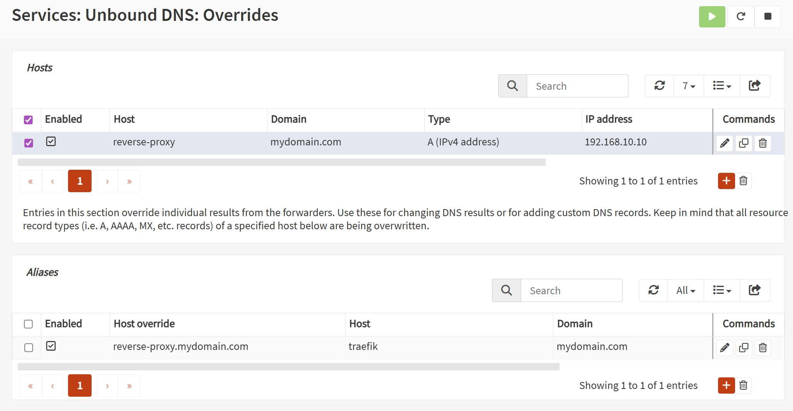

<div align='center'>
    
    <h1>traefik-opnsense-sync</h1>
    <h3>Automated synchronization of DNS overrides from Traefik reverse proxy entries</h3>
</div>

<div align='center'>

[![Go Report Card][go-report-card-shield]][go-report-card-url]
[![GitHub Release][github-release-shield]][github-release-url]
[![discord][discord-shield]][discord-url]

</div>

---

## Table of Contents

<details>
    <summary>Click to expand</summary>

<!-- toc -->

- [About The Project](#about-the-project)
- [Features](#features)
    + [Traefik](#traefik)
    + [Kubernetes](#kubernetes)
    + [OPNsense](#opnsense)
- [Working Principle & Long Explanation](#working-principle--long-explanation)
    * [Example scenario](#example-scenario)
    * [How it works](#how-it-works)
- [Prerequisites](#prerequisites)
    * [OPNsense API Access](#opnsense-api-access)
    * [Create Initial Reverse Proxy Host Override](#create-initial-reverse-proxy-host-override)
    * [Traefik API Access](#traefik-api-access)
    * [Exrex installation (for regex rule expansion, for non-docker installs, optional)](#exrex-installation-for-regex-rule-expansion-for-non-docker-installs-optional)
- [Installation & Running](#installation--running)
    * [Pre-Built Binary](#pre-built-binary)
    * [Docker](#docker)
        + [Simple Docker Run](#simple-docker-run)
        + [Docker Compose](#docker-compose)
- [Configuration](#configuration)
    * [Config File Location](#config-file-location)
    * [Config Structure](#config-structure)
    * [Config Syntax](#config-syntax)
    * [Required Config Entries](#required-config-entries)
    * [Filtering Traefik Routers](#filtering-traefik-routers)
    * [Filtering Kubernetes Resources](#filtering-kubernetes-resources)
- [Common Issues](#common-issues)
    * [TLS: Failed to verify certificate](#tls-failed-to-verify-certificate)
    * [Unable to Access the Traefik API Before Creating DNS Override](#unable-to-access-the-traefik-api-before-creating-dns-override)
    * [Nonsense DNS Overrides Being Created / Skipping Invalid Domain](#nonsense-dns-overrides-being-created--skipping-invalid-domain)

<!-- tocstop -->

</details>

## About The Project

Imagine your homelab is nicely automated, you can automatically deploy new applications using IaC/GitOps practises.
Your local reverse proxy entires are automatically created using Traefik if you deploy a new application,
BUT you still have to manually create DNS overrides to point a given url to your reverse proxy.  
This project removes the last manual step of creating DNS overrides for reverse proxy entries.

The use-case is quite niche, which is why this project was initially supposed to be a short and quick bash script for my
personal use.
However, I decided that I wanted to learn Go and wanted to make a proper Go application out of it with automated
pipelines.

Currently, the application supports only OPNsense Unbound DNS, because that's what I use in my homelab,
as per OPNsense documentation's recommendation. However, if this project were to somehow gain interest,
I could add support for other OPNsense DNS providers and perhaps even other non-OPNsense DNS providers (such as AdGuard
Home or Pi-Hole).

## Features

- Sync once or run as a sync service that polls the configured source at configurable intervals
- Run as a native binary or Docker container (as a simple image or via Docker Compose)
- Supports dry-runs (no changes made to OPNsense)
- Two selectable hostname sources (`sync.source`): Traefik API, or Kubernetes cluster resources
- Supports Traefik v3.x (maybe v2.x works? No idea)
- Supports OPNsense Unbound (tested by me actively on v25.x and any future versions, don't know about older versions)

#### Traefik

- Fetches all HTTP routers from Traefik API
- Parses out domains from router rules
    - Supports expanding out regex rules (e.g. ``HostRegexp(`(ha|haos|home-?assistant)\.example\.com`)``)
    - Supports logical operators in rules (e.g.
      ``(Host(`app.example.com`) || Host(`app2.example.com`)) && !Host(`app3.example.com`) && PathPrefix(`/prefix`)``)
- Supports filtering out routers based on entrypoints, providers, and router names
- Supports basic auth for secured Traefik APIs

#### Kubernetes

- Alternative to the Traefik source (`sync.source: kubernetes`) — reads hostnames directly from a
  Kubernetes cluster instead of Traefik's API
- Supports core `Ingress` (`spec.rules[].host`), Traefik `IngressRoute` CRDs
  (`spec.routes[].match`, including the same `Host()`/`HostRegexp()` rule syntax and regex
  expansion as the Traefik source), and Gateway API `HTTPRoute` (`spec.hostnames`)
- Authenticates using the pod's in-cluster service account only (no kubeconfig support) — see
  [`deploy/k8s/rbac-example.yaml`](deploy/k8s/rbac-example.yaml) for the minimum required RBAC
- Supports filtering by namespace and by individual resource

#### OPNsense

- Manages Unbound DNS override aliases via OPNsense API
- Creates new DNS override aliases for domains found in Traefik routers
- Removes existing DNS override aliases that no longer have a corresponding Traefik router
- Supports API key + secret for secure OPNsense API access
- Doesn't touch other manually/externally created DNS overrides

## Working Principle & Long Explanation

Expand the spoiler below for a long explanation of this app's purpose and how it works.
<details>
<summary>Click to expand</summary>

### Example scenario

You deploy a new local application and want to access the application via `app.mydomain.com`.
So you have a traefik reverse proxy entry (HTTP router & host rule) for `app.mydomain.com` that points to your
application (e.g. `192.168.10.6:1234`).

Great, now you go to `app.mydomain.com` in your browser, but you get 404 (or whatever).
Oh right, it's because your local DNS doesn't know to resolve `app.mydomain.com` to your Traefik reverse proxy.  
Fine, you create a DNS override in your DNS (OPNsense Unbound in this case)  to point `app.mydomain.com` to your Traefik
reverse proxy. Annoying manual step, but whatever.

But now imagine you have 20 applications, maybe you keep adding/removing applications frequently, maybe you have
multiple redirecting aliases for a single application (e.g. both `app.mydomain.com` and `application.mydomain.com` point
to the same application).  
You can imagine how tedious it would become to manually manage all those DNS overrides every time you add/remove an
application or want to add a new alias.  
With this application, you can automatically sync the DNS overrides in OPNsense Unbound based on the Traefik reverse
proxy entries.

### How it works

The Traefik API returns a list of HTTP routers with their properties.
The routers include the host rules that specify the domains they handle.  
Rule example: (unrealistically complex rule, but demonstrates the capabilities)

```
(Host(`app.mydomain.com`) || HostRegexp(`(ha|haos|home-?assistant).mydomain.com`)) && !Host(`app2.mydomain.com`) && PathPrefix(`/prefix`)
```

We can parse out domains that need DNS overrides entries:

- `app.mydomain.com`
- `ha.mydomain.com`
- `haos.mydomain.com`
- `homeassistant.mydomain.com`
- `home-assistant.mydomain.com`

So for each domain above, we need a DNS override entry.  
We could create each of them as DNS host overrides (app.mydomain.com → Traefik IP), but this would clutter the Host
overrides list.  
To solve this problem, OPNsense Unbound supports aliases, where you can map a domain to a specific host override
entry.  
So we create a single host override entry, e.g. `reverse-proxy.mydomain.com` → Traefik IP  
And then we have multiple aliases, e.g. `app.mydomain.com` → `reverse-proxy.mydomain.com`

</details>

## Prerequisites

There are a few things you need to set up once before you can take this application into use

### OPNsense API Access

You need to create an API key + secret with correct permissions to manage Unbound DNS overrides.  
Quick steps:

1. In OPNsense web UI, navigate to `System` → `Access` → `Users`
2. Create a new user
    - Username e.g. `traefik-sync-api-user`
    - Set scrambled password (i.e. this user cannot be logged in to via password)
    - Set privileges:
        - `Services: Unbound (MVC)`
        - `Services: Unbound DNS: Edit Host and Domain Override`
3. Create & download API key + secret for the user by clicking on the little icon to the right of the user entry in the
   users list

You can now set the API key + secret to the application configuration.

### Create Initial Reverse Proxy Host Override

As explained in the [Working Principle & Long Explanation](#working-principle--long-explanation) section,
you need to create one host overrides, to which all the automatically managed override alises will point to.
Quick steps:

1. In OPNsense web UI, navigate to `Services` → `Unbound DNS` → `Overrides`
2. Under Hosts, click on the <kbd>+</kbd> button to create a new Host Override
    - Host: e.g. `reverse-proxy`
    - Domain: your local domain, e.g. `mydomain.com`
    - IP Address: IP address of your Traefik reverse proxy
3. Apply changes by pressing the `Apply` button at the bottom of the page

You should now have a DNS override `reverse-proxy.mydomain.com` → Traefik IP.  
Set `reverse-proxy.mydomain.com` to the config entry `opnsense.host_override`.

### Traefik API Access

If you have
enabled [insecure access to the Traefik API](https://doc.traefik.io/traefik/reference/install-configuration/api-dashboard/#opt-api-insecure),
you should be able to (by default) access the API via directly via Traefik's IP and port 8080:
`http://<traefik-ip>:8080/api/http/routers`.

Exposing insecure access is not recommended though, common alternative ways include creating an HTTP router for the
dasboard/api.  
So you may have a domain such as `traefik.mydomain.com` that points to your Traefik dashboard/api.
But then you of course also need a DNS override for `traefik.mydomain.com` to point to your Traefik reverse proxy.

This is kind of a chicken-and-egg problem since the purpose of this app is to automatically create these DNS
overrides.  
However, just create this one singular DNS override manually in OPNsense Unbound, everything else can be automatically
synced.  
Quick steps:

1. In OPNsense web UI, navigate to `Services` → `Unbound DNS` → `Overrides`
2. If you have multiple Host overrides, click on the one for the reverse proxy to display its aliases
3. Under Aliases, click on the <kbd>+</kbd> button to create a new Host Override Alias
    - Host Override: select the one you created previously, e.g. `reverse-proxy.mydomain.com`
    - Host: e.g. `traefik`
    - Domain: your local domain, e.g. `mydomain.com`
4. Apply changes by pressing the `Apply` button at the bottom of the page

You may also have basic auth enabled for the Traefik API/dashboard, you can set your credentials to the config entries
`traefik.username` and `traefik.password`.

---

Correctly configured OPNsense Unbound might look like:
<details>
<summary>Click to expand screenshot</summary>



</details>

### Exrex installation (for regex rule expansion, for non-docker installs, optional)

> **Only applies to non-docker installs where regex rules (e.g. `HostRegexp(...)`) are used in Traefik!**

To support regex expansion, [`exrex`][exrex-url] needs to be installed and available.
Exrex is a python package that can expand regexes out to all possible matching strings.

From the perspective of this program, it doesn't matter how you install exrex, as long as it is available either in
PATH,
or via a filepath you've set to config entry `regex.exrex_path`.

Easiest way to install exrex is via pip:

```bash
pip install exrex==0.12.0
```

Version shouldn't matter as long as a future update doesn't change exrex's CLI interface.
I can guarantee compatibility with version 0.12.0.

## Installation & Running

You can either download a pre-built binary matching your OS and architecture from the releases page,
run via Docker, or build from source.

### Pre-Built Binary

Head over to the [releases page][github-release-url] and download the appropriate binary for your system.

You can run the binary directly (after ensuring you have set up configuration correctly,
see [Configuration](#configuration) section below).
Although if you plan to use this program as a service that continuously syncs at intervals,
you probably want to set it up as a systemd service, or equivalent.

### Docker

You can run this application via Docker, either as simple container or via Docker Compose.  
If you have a special Traefik setup and expose its API only internally within the container network,
be sure to join this container to the same network, or whatever else is applicable for your setup.

#### Simple Docker Run

You can either specify all config entires as environment variables:  
(Example config entires below, not exhaustive list, see [Configuration](#configuration) section for all options)

```bash
docker run \
    -e TOS_SYNC_DRY_RUN=true \
    -e TOS_TRAEFIK_BASE_URL=https://traefik.mydomain.com \
    -e TOS_TRAEFIK_INCLUDE_ENTRYPOINTS=lan-https \
    -e TOS_TRAEFIK_IGNORE_ROUTERS=traefik-dashboard@file \
    -e TOS_OPNSENSE_BASE_URL=https://192.168.10.1 \
    -e TOS_OPNSENSE_API_KEY=mykey \
    -e TOS_OPNSENSE_API_SECRET=mysecret \
    -e TOS_OPNSENSE_HOST_OVERRIDE=reverse-proxy.mydomain.com \
    -e TOS_OPNSENSE_VERIFY_TLS=false \
    0x464e/traefik-opnsense-sync:latest
```

or you can mount a config file into the container:

```bash
docker run \
    -v /path/to/your/config.yml:/app/config.yml \
    0x464e/traefik-opnsense-sync:latest
```

#### Docker Compose

An example `docker-compose.yml` could look like:

```yaml
services:
  traefik-opnsense-sync:
    image: 0x464e/traefik-opnsense-sync:latest
    # either specify config as env
    environment:
      - TOS_SYNC_DRY_RUN=true
      - TOS_TRAEFIK_BASE_URL=https://traefik.mydomain.com
      - TOS_TRAEFIK_INCLUDE_ENTRYPOINTS=lan-https
      - TOS_TRAEFIK_IGNORE_ROUTERS=traefik-dashboard@file
      - TOS_OPNSENSE_BASE_URL=https://192.168.10.1
      - TOS_OPNSENSE_API_KEY=mykey
      - TOS_OPNSENSE_API_SECRET=mysecret
      - TOS_OPNSENSE_HOST_OVERRIDE=reverse-proxy.mydomain.com
      - TOS_OPNSENSE_VERIFY_TLS=false
# or you can mount a config file instead of env vars
#    volumes:
#       - /path/to/your/config.yml:/app/config.yml 
```

## Configuration

All config options are documented in the [`config.example.yml`](config.example.yml) file in the repository.  
This section will document higher level concepts and important options.

### Config File Location

The application looks for a config file named `config.yml` or `config.yaml` in the current working directory by
default.  
If you want to use a different path for the config file, set environment variable `TOS_CONFIG` to the desired path.

### Config Structure

The config is structured into five main sections: `traefik`, `kubernetes`, `opnsense`, `regex`, and
`sync`.

- `traefik`: Configuration related to Traefik API access and filtering of routers. Only used when
  `sync.source` is `traefik` (the default).
- `kubernetes`: Configuration related to which Kubernetes resources to scan and namespace/resource
  filtering. Only used when `sync.source` is `kubernetes`.
- `opnsense`: Configuration related to OPNsense API access and DNS override management
- `regex`: Configuration related to regex expansion (if used)
- `sync`: Overall syncing behaviour configuration, such as source selection, dry-run, or sync
  interval

All config options can be set either via a YAML config file (default path `./config.yml`),
or via environment variables (prefix `TOS_`, e.g. `TOS_SYNC_DRY_RUN`).
A config entry such as `traefik.base_url` would be set via environment variable `TOS_TRAEFIK_BASE_URL`.

If setting config via both config file and environment variables,
environment variables will take precedence over config file values.

### Config Syntax

When using environment variables, arrays can be set via comma-separated values, e.g.
`TOS_TRAEFIK_INCLUDE_ENTRYPOINTS="web,websecure"`.

Time durations can be set via [Go duration strings](https://pkg.go.dev/time#ParseDuration),
e.g. `5m`, `1h30m`, `45s`, etc.

To avoid secrets in plain text, any config entry can also be set via a file.  
Appending `_FILE` to any config entry name will make the application read the value from a file instead,
e.g. `TOS_OPNSENSE_API_KEY_FILE=/path/to/apikey.txt`.  
You can also use this for secrets mounted at runtime, e.g. Docker secrets pattern.

### Required Config Entries

At minimum, you need to set all the **required** config entries:

- `traefik.base_url`: Base URL of your Traefik API (e.g. `https://traefik.mydomain.com`) — required
  only when `sync.source` is `traefik` (the default)
- `opnsense.base_url`: Base URL of your OPNsense API (e.g. `https://192.168.10.1`)
- `opnsense.api_key`: OPNsense API key (see [OPNsense API Access](#opnsense-api-access) section for instructions)
- `opnsense.api_secret`: OPNsense API secret
- `opnsense.host_override`: The existing OPNsense Unbound host override that all automatically managed aliases will
  point to (see [Create Initial Reverse Proxy Host Override](#create-initial-reverse-proxy-host-override) section for
  instructions)

If you set `sync.source: kubernetes`, `traefik.base_url` is not required, but the application must
be running inside the target Kubernetes cluster with a service account granted the RBAC in
[`deploy/k8s/rbac-example.yaml`](deploy/k8s/rbac-example.yaml).

### Filtering Traefik Routers

What's a Traefik router?  
It's the reverse proxy rule that defines how Traefik should route requests.
You can see all your Traefik routers from your Traefik dashboard.

If you have a Traefik router for an app specified via a file config:

```yaml
http:
  routers:
    my-app:
      rule: Host(`my-app.mydomain.com`)
      entryPoints: [ "lan-https" ]
      service: my-app-service
```

or via labels in a Docker container:

```yaml
labels:
  - "traefik.http.routers.my-app.rule=Host(`my-app.mydomain.com`)"
  - "traefik.http.routers.my-app.entrypoints=lan-https"
```

You can control which routers are considered for DNS override syncing with filters:

* **By entrypoint(s)**: Include only routers on certain entrypoints.  
  Example: `traefik.include_entrypoints: ["lan-https"]`  
  Env: `TOS_TRAEFIK_INCLUDE_ENTRYPOINTS="lan-https,websecure"`
* **By provider(s)**: Include or exclude by source (`file`, `docker`, etc.).  
  Examples: `traefik.include_providers: ["file"]`, `traefik.ignore_providers: ["docker"]`
* **By router name**: Ignore specific routers by their full name `<router>@<provider>`.  
  Example: `traefik.ignore_routers: ["my-app@docker"]`  
  Env: `TOS_TRAEFIK_IGNORE_ROUTERS="my-app@docker"`

### Filtering Kubernetes Resources

When `sync.source: kubernetes` is set, hostnames come from `Ingress`, `IngressRoute`, and/or
`HTTPRoute` resources instead. Pick which kinds to scan with `kubernetes.resources`
(default: `["ingress"]`; `ingressroute` and `httproute` require the Traefik / Gateway API CRDs to
be installed in the cluster).

You can control which resources are considered for DNS override syncing with filters:

* **By namespace**: Include or exclude by namespace. Mutually exclusive.  
  Examples: `kubernetes.include_namespaces: ["default"]`, `kubernetes.ignore_namespaces: ["kube-system"]`
* **By individual resource**: Ignore specific resources by `<name>.<namespace>@<kind>`.  
  Example: `kubernetes.ignore_resources: ["my-app.default@ingress"]`

See [`config.example.yml`](config.example.yml) for the full list of options, and
[`deploy/k8s/rbac-example.yaml`](deploy/k8s/rbac-example.yaml) for the RBAC the service account
needs — only grant rules for the resource kinds you actually enable.

## Common Issues

### TLS: Failed to verify certificate

Since you want/need to access both Trefik/OPNsense directly bypassing your TLS termination,
you may run into TLS certificate verification issues.
Or perhaps you are using self-signed certificates.

If you don't want to put the effort into fixing the TLS issues properly,
or don't know how to, you can just disable TLS verification for both Traefik and OPNsense
via config entries `traefik.verify_tls` and `opnsense.verify_tls`.

### Unable to Access the Traefik API Before Creating DNS Override

You have a chicken-and-egg problem with having a DNS override for Traefik:
You need access to the Traefik API to run this app, but you also need a DNS override to securely
and correctly route yourself to Traefik API.

I have written more about this under prerequisites in the [Traefik API Access](#traefik-api-access) section.  
TLDR: Just create one manual DNS override for Traefik and be done with it.

### Nonsense DNS Overrides Being Created / Skipping Invalid Domain

If you are using regex rules in your Traefik routers (e.g. `HostRegexp(...)`),
you may run into issues where exrex generates nonsense domains that you don't want to create DNS overrides for.

This is most likely caused be you having unbounded regexes that can match an infinite number of strings.  
For example, the regex `.*\.mydomain\.com` can match anything before `.mydomain.com`, exrex will try to
expand this out to all possible matching strings (count generated is limited by config entry `regex.max_generated`,
default 5),
but still, you will get 5 nonsense domains, like `!.mydomain.com`, `".mydomain.com`, etc.

Please make your regex better, or if you truly need to use unbounded regexes that can expand to a very large number of
strings,
the whole concept of creating DNS overrides for them is not for you. You can exclude these specific routers from
syncing. See [Filtering Traefik Routers](#filtering-traefik-routers) section for details.

---

If you see logs like:

```
2025/11/10 19:11:05 skipping invalid domain:  
2025/11/10 19:11:05 skipping invalid domain: !
2025/11/10 19:11:05 skipping invalid domain: "
2025/11/10 19:11:05 skipping invalid domain: #
2025/11/10 19:11:05 skipping invalid domain: $
```

where the domain is empty, you probably are using the default Traefik `redirections` method of redirecting all
traffic from one entrypoint to another.  
A common example being HTTP redirection to HTTPS:

```yaml
entryPoints:
  http:
    address: ":80"
    http:
      redirections:
        entryPoint:
          to: https
          scheme: https
  https:
    address: ":443"
```

Under the hood, this is implemented as a router with rule ``HostRegexp(`^.+$`)``.  
This will expand to an infinite number of strings, and exrex will generate (default 5) nonsense strings that are invalid
domains.
(First 5 printable ASCII characters)

To solve this, you should probably use `traefik.include_entrypoints` so you always only explicitly include routers
which are created on your specified entrypoints.

Alternatively, you can just ignore the specific router that is causing this issue via `traefik.ignore_routers`.  
The router name is auto-generated, you can check it from your Traefik dashboard, in the above example it should be
`http-to-https@internal`.


<!-- MARKDOWN LINKS & IMAGES -->

[go-report-card-shield]: https://goreportcard.com/badge/github.com/0x464e/traefik-opnsense-sync

[go-report-card-url]: https://goreportcard.com/report/github.com/0x464e/traefik-opnsense-sync

[discord-shield]: https://img.shields.io/badge/Discord-join-738ad6?logo=discord&logoColor=white

[discord-url]: https://discord.gg/SQCzaVeBTa

[github-release-shield]: https://img.shields.io/github/v/release/0x464e/traefik-opnsense-sync?logo=github&sort=semver

[github-release-url]: https://github.com/0x464e/traefik-opnsense-sync/releases

[exrex-url]: https://pypi.org/project/exrex/
